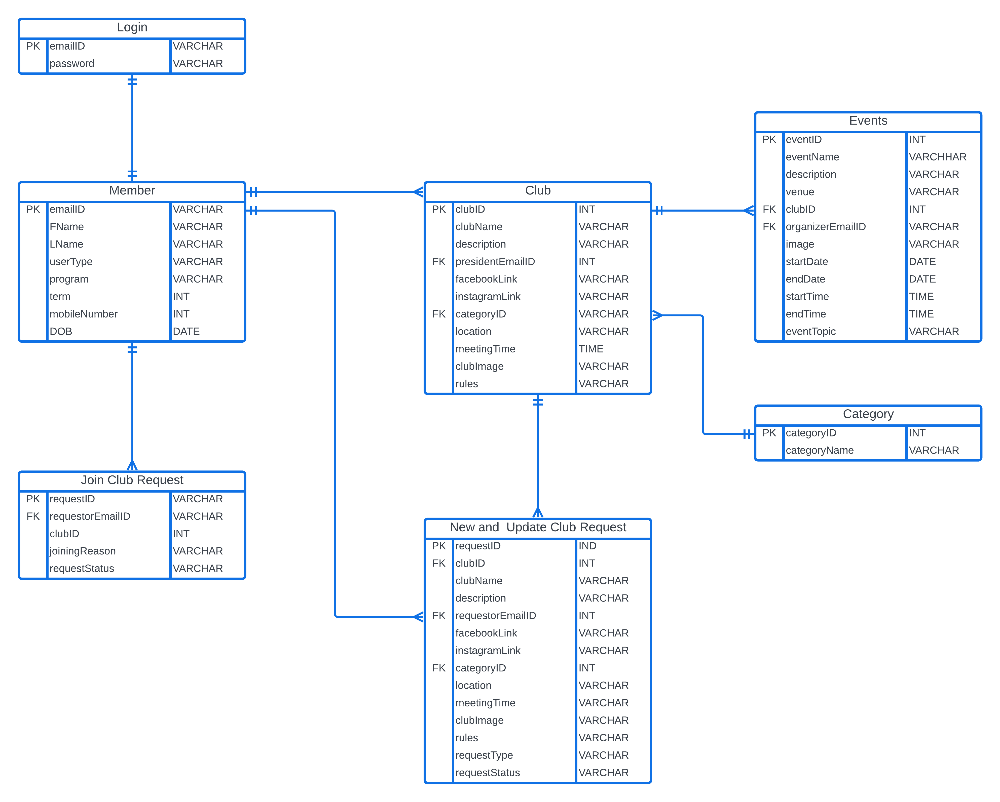

# Dalhousie Clubs Management Application for Dalhousie Societies (DalClubs)

## Introduction

DalClubs application is a club management system designed to simplify and enhance the Dalhousie Student Union's (DSU) management of clubs and societies. The application empowers club presidents, members, and university administration by providing functionalities for managing club activities, events, memberships, and communication. It also provides users with a seamless platform for participating in extracurricular activities, while administrators benefit from efficient tools for managing club operations.

## Purpose

* **Simplify club management**: Facilitate club activities, events, memberships, and communication for clubs and presidents.
* **Enhance student experience**: Offer a seamless platform for students to explore and join clubs, participate in events, and connect with others.
* **Improve DSU operations**: Provide insights into club operations and involvement, enabling DSU to better support student clubs.

## Target Audience

The DalClubs application caters to the following users:

* **Students**: The application empowers students to explore various clubs and societies, join clubs based on their interests, and participate in events. It offers a centralised platform for staying informed and connected with the campus community.
* **Club Presidents**: The application eases the management of club operations, membership tracking, planning events, and facilitating communication within their clubs.
* **DSU and administrators**: The application provides DSU with insights into club operations and involvement through event management. It provides them with a single platform for managing clubs, including the ability to ratify new clubs and discontinue inactive ones.

### README Sections

* **System Overview**: Application's overall structure, including the interaction between the Spring Boot backend and React frontend. It also explains the design principles and goals followed during development.
* **Data models and data flow**: It includes the database schema, data models, and data transformation procedures.
* **Security considerations**: Outlines the measures implemented to protect user data. It covers authentication methods, password hashing, and data encryption techniques.
* **APIs and endpoints**: Lists all the endpoints used in the application's controllers, facilitating interaction between the application and users.
* **Testing strategy**: Testing strategies employed during development, including unit testing, and integration testing.
* **Application screenshots**: Screenshots of the application webpages.

## System Overview

### Architecture and Component Design

The application follows a modular architecture with separate modules for each functionality of clubs, events, and members. Each module has its controller, service, and data layer, ensuring _high cohesion and low coupling_, following **S.O.L.I.D principles**.

### Technology Stack

* **Frontend**: React, Javascript, CSS
* **Backend**: Java- Spring Boot
* **Database**: MySQL
* **Deployment**: Render (backend), Netlify (frontend)
* **Test Driven Development**: Junit
* **Version Control**: GitLab - GitHub

### Key Features

* **Club management**: Create, update, and manage club details, including descriptions, categories, static assets like images, and contact information.
* **Event management**:  Create, register, and manage club events, which include details like dates, times, venues, and descriptions.
* **Membership management**: Members can request memberships of clubs, and Presidents manage existing memberships and approve/reject member requests.
* **Communication**: Facilitating communication between club members and presidents by sending email notifications.
* **Search and filtering**: Users can easily search for clubs and events.

### Design Goals and Constraints

The design of the DalClubs application prioritized the following:

* **High cohesion and low coupling**: Adhering to this principle ensures modularity and simplifies maintenance.
* **Seamless user experience**: Both frontend and backend components are designed for intuitive and user-friendly interaction.
* **Efficient API endpoints implementation**: Modularizing and strategically exposing API endpoints for serving front-end requests in a robust and reliable backend infrastructure.
* **Continuous deployment and maintenance**: Using GitLab Runners for running the CI/CD pipeline on GitLab. Render and Netlify facilitate automated deployment and updates.

### Limitations

Due to resource constraints, the application is currently deployed on free tiers of Render and Netlify, which may have limitations regarding resource capacity. Additionally, integrating React with Spring Boot can be challenging regarding cross-origin requests and data flow management.

### Sequence Diagrams or Flow Diagrams:

## Data Models and Data Flow

The application uses a relational database model with normalized tables to store and manage various entities and their relationships. The tables and their attribute details are as follows:

1. **member**:

    * **emailID**: Unique identifier for each member (Primary Key)
    * **firstName, lastName**: Member's full name
    * **userType**: Member type (student, admin, club president)
    * **program, term**: Student's academic program and term
    * **mobileNumber, DOB**: Contact information and date of birth
    * **emailID - foreignKey**: References the login table for user authentication

2. **login**:

    * **emailID**: (Primary Key, Foreign Key references member)
    * **password**: Hashed password for secure authentication

3. **category**:

    * **categoryID**: Unique identifier for each category (Primary Key)
    * **categoryName**: Name of the club category

4. **club**:

    * **clubID**: Unique identifier for each club (Primary Key)
    * **clubName, description**: Name and description of the club
    * **presidentEmailID**: Email of the club president (Foreign Key references member)
    * **facebookLink, instagramLink**: Social media links
    * **categoryID**: Category that the club belongs to (Foreign Key references category)
    * **location, meetingTime**: Meeting location and time
    * **clubImage**: Image of the club homepage banner
    * **rules**: Club rules and regulations

5. **joinClubRequest**:

    * **requestID**: Unique identifier for each join club request (Primary Key)
    * **requestorEmailID**: Email of the member requesting to join (Foreign Key references member)
    * **clubID**: ID of Club the member is requesting to join (Foreign Key references club)
    * **joiningReason**: Reason for joining the club
    * **requestStatus**: Status of the request (pending, approved, rejected)

6. **events**:

    * **eventID**: Unique identifier for each event (Primary Key)
    * **clubID**: ID of Club hosting the event (Foreign Key references club)
    * **organizerEmailID**: Email of the event organizer (Foreign Key references member)
    * **eventName, description**: Event name and description
    * **venue**: Event location
    * **image**: Event images for users
    * **startDate, endDate, startTime, endTime**: Event duration
    * **eventTopic**: Topic covered in the event

7. **newAndUpdateClubRequest**:

    * **requestID**: Unique identifier for each request (Primary Key)
    * **clubID**: ID of Club being updated or created (Foreign Key references club)
    * **requestorEmailID**: Email of the member requesting the change (Foreign Key references member)
    * **categoryID, clubName, description, etc.**: Details of the club being updated/created
    * **requestType**: Type of request (create, update)
    * **requestStatus**: Status of the request (pending, approved, rejected)

#### Conceptual Model - Crow Foot Model

## Security considerations

Here is an overview of the implemented security mechanisms:

### User Authentication and Access Control:

* **JSON Web Tokens (JWTs)**: JWTs are utilized for user authentication and access control, providing a stateless and scalable approach. It contains user identification details and roles, signed with a secret key for integrity and authenticity.
* **Role-Based Access Control (RBAC)**: JWTs include user roles, and Spring Security filters enforce access permissions based on these roles and endpoint matches.
* **Password Hashing**: The BCrypt algorithm is employed for securely hashing passwords before storing them in the database, making them resistant to brute-force and dictionary attacks.

### Data Encryption and Protection:

* **SQL Stored Procedures**: Stored procedures prevent SQL injection attacks by treating user input as parameters, not directly concatenated into SQL queries. This secures database interactions.

## APIs and endpoints

The various endpoints used in the Controllers of each component are as follows:

| Endpoint | Description | Access Level/User Type |
|---|---|---|
| /member/registerClub | Accepts new club request details | Member |
| /unauthenticated/getAllClubCategory | Retrieves all club categories | Unauthenticated |
| /unauthenticated/getClubByName/{name} | Searches for clubs by name | Unauthenticated |
| /unauthenticated/getClubByCategory/{category} | Filters clubs by category | Unauthenticated |
| /president/updateClubDetails | Updates existing club details | President |
| /unauthenticated/approveClubRequest/{reqId} | Approves club update or new club request | Unauthenticated (for club president) |
| /unauthenticated/rejectClubRequest/{reqId} | Rejects club update or new club request | Unauthenticated (for club president) |
| /admin/deleteClub | Deletes club and related events | Admin |
| /unauthenticated/joinClubRequest | Submits request to join a club | Unauthenticated |
| /president/getAllJoinClubRequests | Retrieves all join club requests for a club | President |
| /president/approveJoinClubRequest/{reqId} | Approves member's join club request | President |
| /unauthenticated/rejectJoinClubRequest/{reqId} | Rejects member's join club request | President |
| /admin/getAllNewClubRequests | Retrieves all new club requests | Admin |
| /admin/getAllUpdateClubRequests | Retrieves all club update requests | Admin |
| /unauthenticated/getAllEvents | Retrieves a list of all events | Unauthenticated |
| /president/createEvent | Creates a new event | President |
| /unauthenticated/getAllEvents/{userEmailId} | Retrieves events registered by a user | Unauthenticated |
| /unauthenticated/registerEvents/{eventID}/{emailID} | Registers a user for an event | Unauthenticated |
| /unauthenticated/getEventDetails/{nameOfEvent} | Retrieves event details | Unauthenticated |
| /president/updateEventDetails | Updates event details | President |
| /president/deleteEvent | Deletes event and clears registrations | President |
| /unauthenticated/getEventByClub/{clubID} | Retrieves events by club ID | Unauthenticated |
| /api/registerMember | Accepts new member registration details | Unauthenticated |

### Testing Strategy

The application employs the following testing strategies:

#### Unit Testing:

* **Data and Service Layer Tests**: Each module has dedicated data and service layer tests extending a base BaseTest class, promoting code coverage and isolation.
* **Database Integrity**: Tests utilize random data and ensure its deletion after execution, to maintain database integrity and enable parallel test execution on CI/CD pipelines.

#### Integration Testing:

* **Leveraging BaseTest**: The BaseTest class enables the creation of diverse objects like members, clubs, events, and requests, facilitating integration testing between modules.
* **Scenario Testing**: Scenarios like club update request approval and automatic member type promotion to a president are tested to validate inter-module interactions.

#### System Testing:

* **Manual Black-Box Testing**: The deployed application undergoes manual black-box testing, focusing on functionalities like club filtering and data consistency with the database table records.
* **Tester Independence**: As the test cases are randomized and automated within integrity limits the testers access the front-end without the comprehensive knowledge of the backend data flow, this ensures a comprehensive system-level evaluation/testing.

#### User Acceptance Testing:

* **Cloud Deployment**: The application is deployed on Netlify and Render to simulate a production environment for user testing.
* **User-Centric Evaluation**: End-users test key functionalities like login, displaying club/event details, and overall system behaviour on a cloud-based production environment.

#### Benefits:

* Improved code quality and identification of potential issues early in the development cycle.
* Enhanced confidence in system functionality and user experience before deployment.
* Continuous testing practices contribute to a more stable and reliable application.

## Application screenshots

#### Admin page:

#### Club page:

#### Event page:

#### Find All Clubs page:

#### Find All Events page:

#### Login Page

#### Recommender Page

<!-- ## Future Considerations

### Testing Strategy

* Implementing automated UI testing tools for broader test coverage using selenium.
* Implementing performance testing to evaluate system scalability and responsiveness under load. -->

---